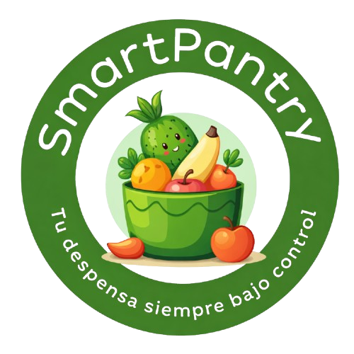
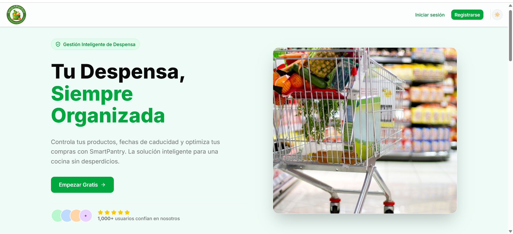

#  SmartPantry: Gestión Inteligente de Despensa

> **Proyecto Final de Grado Superior en Desarrollo de Aplicaciones Web (DAW)** > **Centro:** IES Albarregas (Mérida)  
> **Autora:** Rebeca Poma

---

## 📸 Vista Previa del Proyecto
Para ver la aplicación en funcionamiento, haz clic abajo:
> 

---

## 📋 1. Descripción del Proyecto
**SmartPantry** es una solución web avanzada diseñada para optimizar la economía doméstica y erradicar el desperdicio de alimentos. Centraliza el inventario del hogar para evitar compras duplicadas y rupturas de stock, permitiendo a las familias tomar decisiones basadas en datos reales de consumo.

## 🎯 2. Objetivos Principales
* **Gestión Centralizada:** Unificar el control de stock para garantizar la integridad de los datos familiares.
* **Inteligencia Financiera:** Visualizar gastos históricos y detectar productos de alto impacto económico.
* **Sostenibilidad:** Reducir el desperdicio alimentario mediante alertas de caducidad y stock mínimo.
* **Presupuesto Predictivo:** Generar listas de compra automáticas con estimaciones de gasto exportables a WhatsApp.

## 🛠️ 3. Stack Tecnológico


---

## ✨ 4. Funcionalidades Estrella
| Funcionalidad | Descripción |
| :--- | :--- |
| **🟢 Semáforo de Stock** | Alertas visuales automáticas cuando un producto alcanza su punto crítico. |
| **📊 Dashboard Analítico** | Gráficas dinámicas de gastos semanales y mensuales exclusivas para el Gestor. |
| **🛍️ Compra Múltiple** | Registro dinámico de tickets completos separando el nombre del formato descriptivo (Kg, L, Packs). |
| **🔒 Seguridad RLS** | Aislamiento total de datos entre familias mediante políticas de Row Level Security. |
| **📱 Mobile First** | Diseño optimizado para una experiencia fluida desde cualquier dispositivo móvil. |

---

## 👥 5. Roles y Jerarquías
El sistema implementa una arquitectura multi-tenant con tres perfiles estrictos:
1.  **Súper Administrador:** Auditoría global y gestión de unidades familiares.
2.  **Gestor (AdminUser):** Administrador del hogar. Único perfil con permisos CRUD sobre catálogo y finanzas.
3.  **Miembro (Usuario):** Colaborador con permisos de consulta y notificación de consumo rápido.

---

## 📅 6. Evolución y Seguimiento del Proyecto

### 👨‍🏫 Fase Intermodular (Tutor: Paco Mera)
| Fecha | Actividad |
| :--- | :--- |
| **12-Sep** | Presentación de Asignatura y Propuesta de Proyecto. |
| **19-Sep** | Identidad Corporativa y Diseño de Marca. |
| **26-Sep** | Recogida de Necesidades y Elaboración de Contrato. |
| **03-Oct** | Definición de Requisitos Funcionales y No Funcionales. |
| **10-Oct** | Prototipado e Interfaces Gráficas (UI/UX). |
| **17-Oct** | Estructuración y Diseño de la Base de Datos. |
| **24-Oct** | Definición del Modelo Relacional. |
| **31-Oct** | Presentación de Mockups y Esquema de Datos. |
| **07-Nov** | Selección del Stack Tecnológico Final. |
| **14-Nov** | Inicio de Documentación Técnica. |
| **21-Nov** | Estructuración de Manuales de Usuario. |
| **05-Dic** | Desarrollo de Documentación de Soporte. |
| **12-Dic** | Estrategia de Despliegue. |
| **19-Dic** | Pruebas en Entorno Local (TomCat). |
| **09-Ene** | Primeras pruebas de despliegue en Vercel. |
| **16-30 Ene** | Fase Intensiva de Desarrollo y Pruebas de Sistema. |

### 👨‍🏫 Fase TFG (Tutor: Jesús García)
*(Sesiones de tutoría todos los jueves a partir del 16/04)*
| Fecha | Actividad |
| :--- | :--- |
| **16-Abr** | Auditoría de código y nuevos requerimientos de tutoría. |
| **23-Abr** | Refactorización de BD: Separación de campo **Formato** (Kg, L, Packs). |
| **30-Abr** | Implementación del Formulario de Compra Múltiple dinámico. |
| **07-May** | Resolución de errores de TypeScript y Despliegue Final en Producción. |

---

## 🚀 7. Guía de Inicio Rápido

### Instalación Local
```bash
# 1. Clonar
git clone [https://github.com/rebecapoma6/SmartPantry.git](https://github.com/rebecapoma6/SmartPantry.git)

# 2. Instalar
npm install

# 3. Configurar .env
VITE_SUPABASE_URL=tu_url
VITE_SUPABASE_ANON_KEY=tu_key

# 4. Despegar
npm run dev